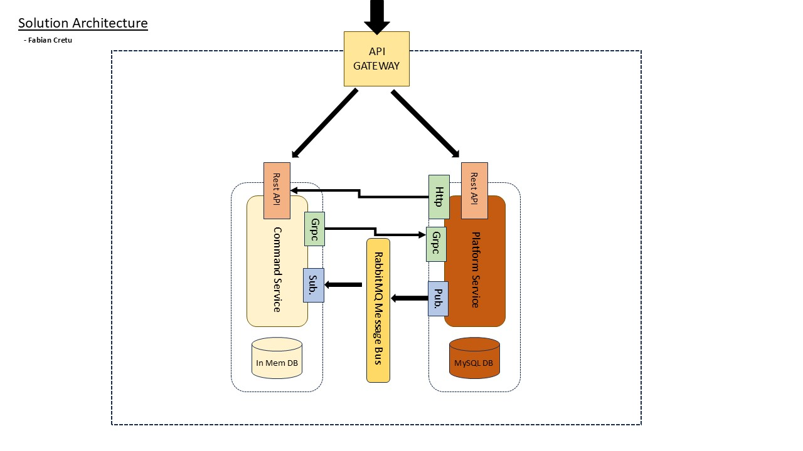

# Distributed Microservices Architecture for Command & Platform Services



## Overview

This project implements a **Distributed Microservices Architecture** tailored for Command and Platform Services using .NET and C#. Designed for scalability, resilience, and efficiency, the architecture leverages modern technologies such as Kubernetes, Docker, RabbitMQ, gRPC, and MySQL to deliver robust and high-performance solutions.

## Features

- **Scalable Microservices Solution**
  - Developed using .NET and C#, incorporating an API Gateway for centralized routing.
  
- **Service Segmentation**
  - Functionalities are divided into Command and Platform services.
  - Utilizes in-memory databases for real-time processing and MySQL for persistent storage.
  
- **Efficient Communication**
  - Implemented gRPC for high-performance inter-service communication.
  - RabbitMQ is used for message brokering to ensure seamless data flow and service decoupling.
  
- **Secure Client Interactions**
  - Developed REST APIs to facilitate secure and reliable client interactions.

## Architecture


*Click on the diagram to explore the architecture in detail.*

## Technologies Used

- **.NET & C#**
  - Core development framework and programming language for building microservices.
  
- **Kubernetes**
  - Container orchestration platform for deploying, scaling, and managing microservices.
  
- **Docker**
  - Containerization platform to ensure consistent environments across development and production.
  
- **RabbitMQ**
  - Message broker for handling asynchronous communication between services.
  
- **gRPC**
  - High-performance RPC framework for efficient inter-service communication.
  
- **MySQL**
  - Relational database for persistent data storage.

## Getting Started

### Prerequisites

- **Docker**: [Install Docker](https://www.docker.com/get-started)
- **Kubernetes**: [Set up Kubernetes](https://kubernetes.io/docs/setup/)
- **.NET SDK**: [Download .NET](https://dotnet.microsoft.com/download)
- **MySQL**: [Install MySQL](https://www.mysql.com/downloads/)

### Installation

1. **Clone the Repository**

    ```bash
    git clone https://github.com/yourusername/your-repo-name.git
    ```

2. **Navigate to the Project Directory**

    ```bash
    cd your-repo-name
    ```

3. **Build Docker Images**

    ```bash
    docker-compose build
    ```

4. **Deploy to Kubernetes**

    ```bash
    kubectl apply -f k8s/
    ```

5. **Access the API Gateway**

    - Once deployed, access the API Gateway to interact with the microservices.

## Usage

- **API Gateway**: Central point for all client requests, routing them to the appropriate microservices.
- **Command Services**: Handle real-time processing using in-memory databases.
- **Platform Services**: Manage persistent data storage with MySQL.
- **Communication**: Utilize gRPC for internal service calls and RabbitMQ for asynchronous messaging.

## Contributing

Contributions are welcome! Please follow these steps:

1. **Fork the Repository**
2. **Create a Feature Branch**

    ```bash
    git checkout -b feature/YourFeature
    ```

3. **Commit Your Changes**

    ```bash
    git commit -m "Add some feature"
    ```

4. **Push to the Branch**

    ```bash
    git push origin feature/YourFeature
    ```

5. **Open a Pull Request**

## License

This project is licensed under the [Special License](LICENSE).
